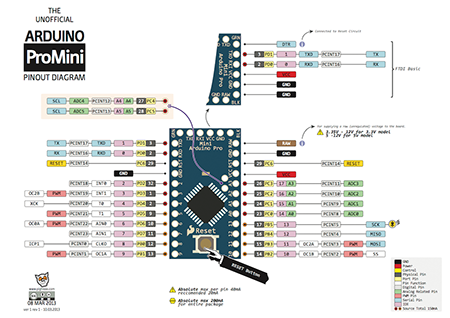

## Groundwater meter challenge

This is a simple guide to get started with the content of the hardware kits!

### Base platform

 * Arduino Pro Mini 3.3V 8Mhz [Datasheet](https://www.arduino.cc/en/Main/arduinoBoardProMini), [Getting started](https://www.arduino.cc/en/Main/arduinoBoardProMini)
 * FTDI (USB to UART brige) [HOWTO Video](https://www.youtube.com/watch?v=-Myj5yQvI_4)
 * Microchip RN2483 LoRaWAN modem [Datasheet](http://ww1.microchip.com/downloads/en/DeviceDoc/50002346B.pdf)
 * Breadboard power supply [Datasheet](https://hobbyking.com/media/file/403178644X1017066X57.pdf), [How to use](https://www.sunfounder.com/wiki/index.php?title=How_to_use_YwRobot_Power_Supply_Properly)

Tutorials and lots of info specific for this event is popping up in [rac2030's github repo](https://github.com/rac2030/MakeZurich/wiki#tutorials-or-logs).

### Sensors

 * Keller Druck PR-36 X(W) / 1bar ~ 10mH2O: [Datasheet](http://www.keller-druck.ch/home_g/paprod_g/36xw_g.asp)
 * Keller Druck PR-26 D / 0,3bar ~ 3mH2O: [Datasheet](http://www.keller-druck.ch/home_g/paprod_g/4ld_g.asp)
 * Water temperature sensor:
    * [DS18B20 Waterproof temperature sensor](http://image.dfrobot.com/image/data/DFR0198/DS18B20.pdf)
    * [DFR0055 Plugable terminal adapter](https://www.dfrobot.com/wiki/index.php/Terminal_sensor_adapter_V2.0_(SKU:DFR0055))
    * [FIT0011 digital sensor connection line DS18B20](https://www.dfrobot.com/wiki/index.php/Digital_Sensor_Cable_For_Arduino_(SKU:FIT0011))

> **NOTE:** Please read the printed manual for the pressure sensors carefully for **voltage** and **connectivity**

### Basic resources

 * LoRaWAN & The Things Network:
    * [Documentation](https://www.thethingsnetwork.org/docs/)
    * [Arduino devices](https://www.thethingsnetwork.org/docs/devices/arduino/)
    * [Forum](https://www.thethingsnetwork.org/forum/)
 * Hackathon community platform:
    * [Hackathon projects](https://now.makezurich.ch)
    * [Slack team](https://ttn-ch.slack.com/) (sign up here [here](https://ttn-ch.herokuapp.com/))
 * Various posts/articles:
    * [How to build your first TTN node](https://www.thethingsnetwork.org/forum/t/how-to-build-your-first-ttn-node-arduino-rn2483/1574)
    * [Building a TTN LoRaWAN node](https://www.vdsar.net/build-ttn-lora-node/)

### Keller Druck Support

Available during business hours.

 * Via phone hotline: +41 052 235 2525: Denys Schellenberg / Daniel Hofer / Silvan Achtnich / Marcel Gautschi
 * Direct:
    * Daniel Hofer – Produktmanager: Schwerpunkt D-Line, d.hofer@keller-druck.ch, +41 79 602 0424
    * Silvan Achtnicht – Entwickler: Schwerpunkt X-Line, s.achtnich@keller-druck.ch, +41 76 565 5254

 * Sensor test equipment available at the MechArtLab (6th Floor) by Urs

> **NOTE:** Please keep in mind the voltage differences between the microcontroller and the different sensors when connecting them. 
> **NOTE:** Always have the antenna connected when powering up your LoRaWAN module.
